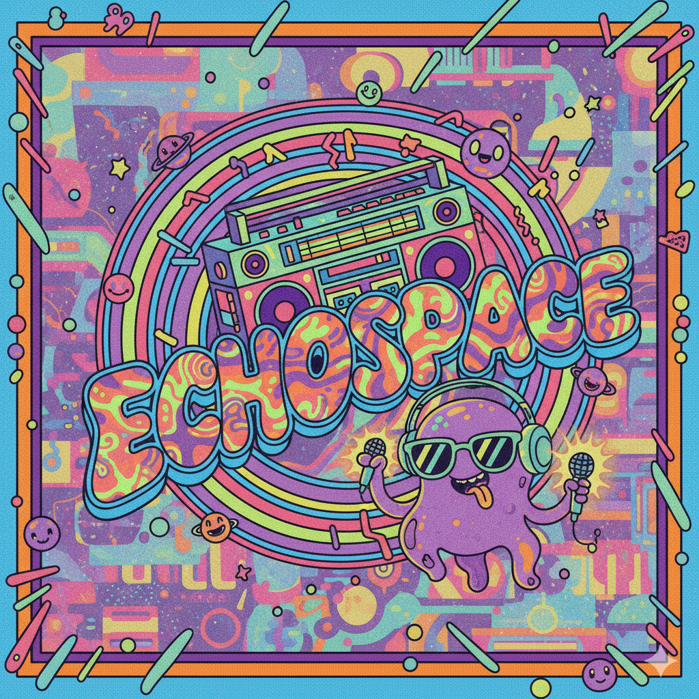

  

<h3 align="center">ECHOspace Real-time Chat</h3>

  A feature-rich, real-time chat application built with React and a full Firebase backend.  
  <a href="https://github.com/VikasKushwaha5424/ECHOspace/issues">Report Bug</a> ·
  <a href="https://github.com/VikasKushwaha5424/ECHOspace/issues">Request Feature</a>

---

## 🖼️ Demo Screenshot

---

## 📦 About The Project

ECHOspace is a modern, web-based chat application inspired by leading messaging platforms.  
Users can register, log in, search for others, and chat privately in real time with both text and images.  
The dynamic frontend is built with React.js. Backend is powered by Firebase using Authentication, Firestore, and Storage.

---

## ✨ Key Features

- 🔐 **Firebase Authentication**: Secure user registration and login using email and password.
- 💬 **Real-time Chat**: Instant messaging powered by Firestore's `onSnapshot` listener.
- 🖼️ **Image Uploads**: Send images in chats, directly uploaded to Firebase Storage.
- 🔍 **User Search**: Quickly find any registered user and start a conversation.
- 🌓 **Light/Dark Mode**: Theme toggle respects user preference and persists in `localStorage`.
- 🎨 **Custom Backgrounds**: Personalize your chat window; settings saved to Firestore user profile.
- 👤 **Avatars & Initials**: User-uploaded avatars, with color-generated initial fallback.
- 🗑️ **Delete Chats**: Remove unwanted chats from your personal list.
- 📱 **Responsive Design**: Mobile-first layout built with SASS/SCSS.
- ⚛️ **Modern React**: Fully functional components, hooks, and Context API for global state.

---

## 🛠️ Built With

- [React.js](https://reactjs.org/) (Frontend Library)
- [Firebase](https://firebase.google.com/) (Backend-as-a-Service)
  - Firebase Authentication
  - Cloud Firestore
  - Firebase Storage
- [SASS/SCSS](https://sass-lang.com/) (CSS Preprocessor)
- [React Router v6](https://reactrouter.com/) (Routing)
- [React Context API](https://reactjs.org/docs/context.html) (Global State Management)

---

## 🚀 Getting Started

To run ECHOspace locally, follow these steps:

### Prerequisites

You must have [Node.js](https://nodejs.org/) installed.

### Installation
### Clone the repo
git clone https://github.com/VikasKushwaha5424/ECHOspace.git

### Go to project directory
cd ECHOspace

### Install dependencies
npm install

### Run the app
npm start

---

## 🔑 Firebase Configuration

1. Go to [Firebase Console](https://console.firebase.google.com/) and create a new project.
2. Enable the following services for your backend:
   - **Authentication** (Email/Password method)
   - **Cloud Firestore** (create a database)
   - **Storage** (create a storage bucket)
3. Create a new Web app in your Firebase project.
4. Copy the provided `firebaseConfig` object and use it in `src/firebase.js`:

---

---

## 🤝 Contributing

Contributions, issues, and feature requests are welcome!  
Check out [issues](https://github.com/VikasKushwaha5424/ECHOspace/issues), fork the repo, make changes, and submit a pull request.

---

## 📃 License

Distributed under the MIT License. See `LICENSE` for details.

---

## 📫 Contact

## Credit 
#### - Vikas Kushwaha
#### - connect with me on linkedln www.linkedin.com/in/vikaskushwaha5424

---

Enjoy real-time chatting with ECHOspace! 🚀

